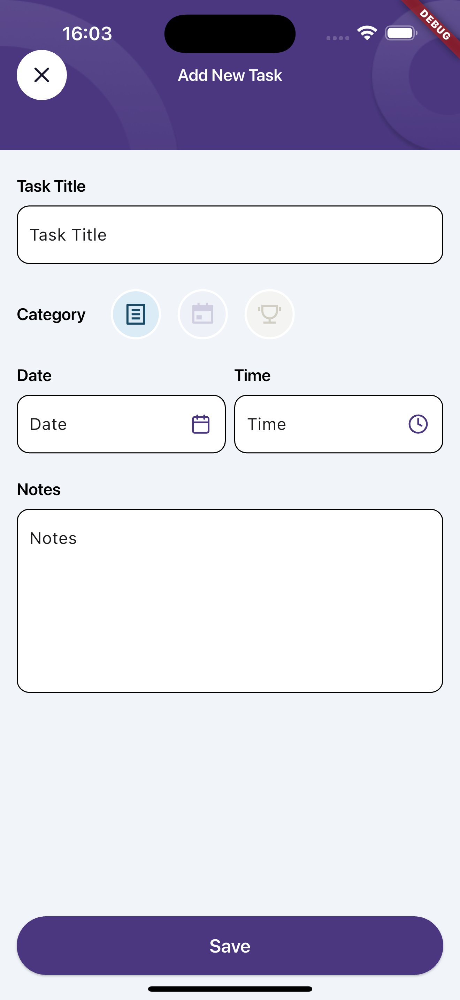

# Todo App

This is the Todo App using Provider to manager states

## How to get started on the project

Type this command in the terminal

```sh
  - chmod +x runner.sh
  - ./runner.sh
```

Or

```sh
  flutter pub get
  flutter gen-l10n
  flutter run
```

Use this command to add some assets (image, font, etc.)

```sh
  flutter pub run build_runner build --delete-conflicting-outputs
```

Use this command when you want to build a developed APK version in the Git Bash terminal

```sh
  bash scripts/build_dev_apk.sh
```

Or use this command when you want to build a product APK version in the Git Bash terminal

```sh
  bash scripts/build_pro_apk.sh
```

Or use this command when you want to Debug the developed version in the Git Bash terminal

```sh
  bash scripts/build_debug.sh
```

## App Running

While running app

<p align="center">
  
</p>
ScreenShot of app

<p align="center">
  
  
  
</p>

<p align="center">
  
  
  
</p>

### Project Structure

```
$PROJECT_ROOT
├── lib                  # Main application code
│   ├── common           # Reusable UI components (widgets)
│   ├── configs          # Folder stores static variables (e.g., color of buttons)
│   ├── gen              # Folder for generated code (e.g., from build_runner)
│   ├── l10n             # Localization files
│   ├── local            # Folder for communicating with local storage
│   ├── manager          # Folder for managing information (e.g., token, user's last login information)
│   ├── models           # Data models (e.g., User, Note, etc.)
│   ├── network          # Folder for communicating with remote storage
│   ├── theme            # Folder for custom app theme
│   ├── utils            # Folder for reused functions
│   └── views            # Folder for views
├── assets               # Static resources (images, gifs, etc.)
└── pubspec.yaml         # Flutter project configuration file
```
